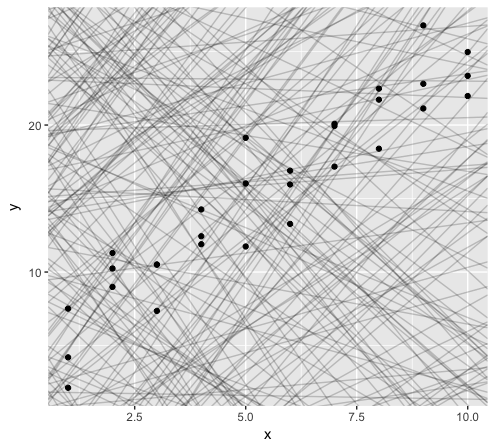

```{r setup, include=FALSE}
knitr::opts_chunk$set(
  echo = FALSE,
  comment = "#>",
  collapse = TRUE,
  warning = FALSE,
  message = FALSE
  )

beauty_number <- function(x) format(x, digits = 2, big.mark = ",")

library(tidyverse)

small_diamonds <- diamonds %>%
  filter(carat<=2.5)

n <- nrow(small_diamonds)
```

## Ejemplo de diamantes

Ahora tenemos `r n` diamantes. Por tanto solamente hay `r nrow(diamonds) - n` diamantes que superen los 2.5 *kilates*. 

La distribución del resto de diamantes es la siguiente:

```{r plot_diamonds, echo = FALSE}
small_diamonds %>%
  ggplot(aes(carat)) +
  geom_freqpoly(binwidth = 0.01)
```

Guía para formatear los textos
----------------------------------------------------

*Este texto está en itálica* o también _Este otro texto también está en cursiva_

**Este texto está en negrita** o también __Este otro texto también lo está__

En caso de querer escribir código `colocamos un backstick`

Si queremos elevar podemos escibir x^2^ o para subíndices  x~2~
 

Guía para crear encabezados 
-----------------------------------------------------

# Primer nivel de cabecera

## Segundo nivel de cabecera

### Tercer nivel de cabecera

#### Cuarto nivel de cabecera

##### Quinto nivel de cabecera
 
Guía para crear listas
----------------------------------------------------
* Primer ítem
* Segundo ítem
    * Segundo ítem A
    * Segundo ítem B
* Tercer ítem

1. Ítem numerado
1. Segundo ítem numeroado (autoincremental)

Guía de links e imágenes
------------------------------

<https://udemy.com/u/juangabriel2>

Perfil público de [Juan Gabriel](https://udemy.com/u/juangabriel2)  en udemy



Guía para Tablas
----------------------------------

Primera Cabecera | Segunda Cabecera
---------------- | ----------------
Contenido 1.1    | Contenido 1.2
Contenido 2.1    | Contenido 2.2
Contenido 3.1    | Contenido 3.2


Guía para el código
---------------------------------------

```{r summary_cars, eval = TRUE, results = 'asis'}
print(xtable::xtable(head(mtcars, 10), 
             caption = "Una tabla estilizada con xtable"),
      type = "html")

knitr::kable(head(mtcars, 10), 
             caption = "Una tabla estilizada con knitr")

mtcars %>% ggplot(aes(mpg)) + geom_histogram()
```

```{r load_data, cache.extra = file.info("../data/cars.csv")}
data <- read_csv("../data/cars.csv")
```

```{r process_data, cache = TRUE}

processed_data <- data %>%
  filter(mpg < 20) %>%
  mutate(new_var = mpg/disp)

knitr::kable(processed_data)

```

El número pi es: $\pi =  `r beauty_number(pi)`$, y un número muy grande sería `r beauty_number(123456.789)` y un número con muchos decimales `r beauty_number(0.125678)`
